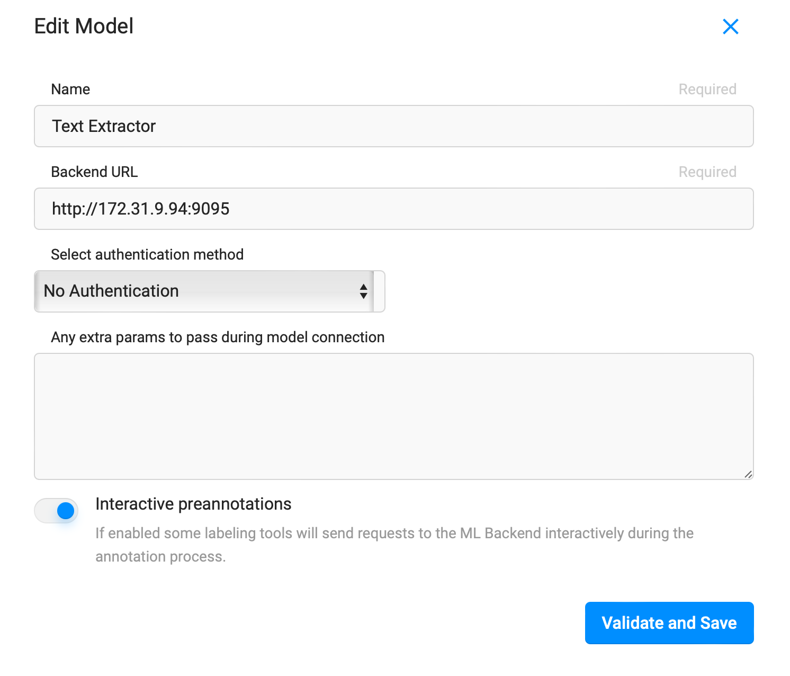
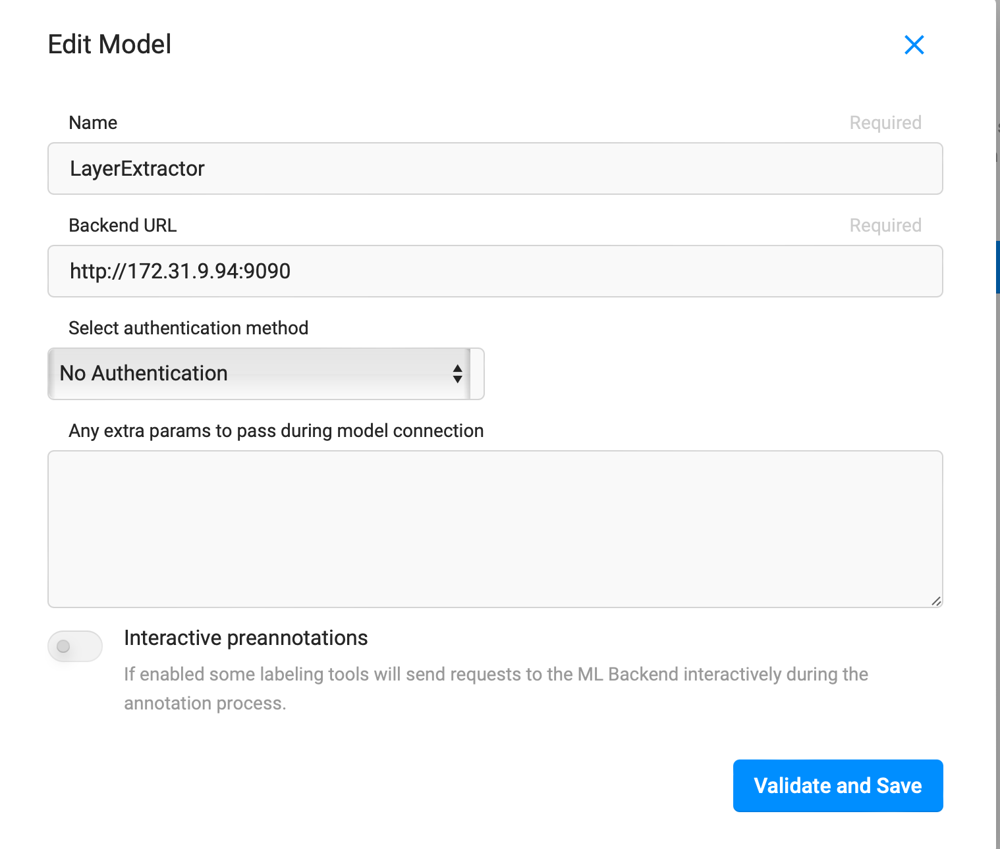

  

[Website](https://labelstud.io/) • [Docs](https://labelstud.io/guide/) • [Twitter](https://twitter.com/labelstudiohq) • [Join Slack Community ](https://slack.labelstud.io/?source=github-1)


For the official documentation we refer to the parent label studio [repository](https://github.com/heartexlabs/label-studio).

# Deployment Guide
The below is a guide on how to deploy the label studio instance including their ml-backends. The deployment is meant for an EC2 (or other VM) and we assume that the infrastructure has already been set up.

The deployment steps are:
1. Adjust the docker-compose.yml files for label-studio and label-studio-ml-backend to contain the right volumes.
2. Build and run label-studio docker and label-studio-ml-backend instances
3. Setup your label studio instance

## 1. Adjusting Docker Compose
Adjust the docker-compose files to:
1. Mount the directory with the data to the `app` service in label studio as well as in all ml-backend services.
The right structure is something like `/home/ubuntu/data:/label-studio/files`. `/label-studio/files` needs to have a directory called `evaluation` containing the pdfs and `test_png` containing all corresponding png files.
2. Adjust the port for `app` on which your application shall run. If you want to publish your application and make it easily accessable your the default port 80.

## 2. Build and run docker instances
In order to build and run your docker instances on your EC2 instance, do:
1. Clone the repositories on your EC2.
2. Create a data directory and upload all data for your application in that repository.
3. Create a new tmux session called ml-backend and label-studio in your EC2: `tmux new -s ml-backend` &  `tmux new -s label-studio`.
4. Attach to the tmux session using `tmux a -t ml-backend` or `tmux a -t label-studio`. Navigate to the respective docker-compose and do `sudo docker compose build` to build all docker images.
5. Then, inside the respective tmux session do `sudo docker compose up` and your services should be up and running.

Tmux helps you keep processes alive even if you kill your shell instance. A cheatsheet regarding tmux commands can be found [here](https://tmuxcheatsheet.com).


## 3. Setup label-studio
1. Navigate to the URL of your EC2 (make sure you allow inbound traffic to the port on which label-studio listens in the security group of your EC2.)
2. Create a new user, and log in using it.
3. Create a new project from the UI.
4. Go to settings --> Cloud Storage --> Add Source Storage.
    Choose storage type `local files` and add the path to the data (the volume you have previously mounted)
5. Set up the labeling interface: Go to Settings --> Labeling Interface --> Code and paste
```html
<View>
  <Image name="image" value="$ocr"/>

  <Labels name="label" toName="image">
    <Label value="Material Description" background="green"/>
    <Label value="Depth Interval" background="blue"/>
  <Label value="Coordinates" background="#FFA39E"/></Labels>

  <Rectangle name="bbox" toName="image" strokeWidth="3"/>
  <Polygon name="poly" toName="image" strokeWidth="3"/>

  <TextArea name="transcription" toName="image" editable="true" perRegion="true" required="true" maxSubmissions="1" rows="5" placeholder="Recognized Text" displayMode="region-list"/>
</View>
```
6. Add the ML Backends: Go to settings --> Model --> Add Model. The screenshots below outline the model settings. Make sure to adjust the IP of the Backend URLs to the private IP of your EC2 instance.


If you can't add the model from the UI, you can do it using the below API call. Check out the [API Reference](https://labelstud.io/api) for details about the API. You can generate your own token in the label-studio UI when clicking on your user in the top right corner.
```bash
curl -X POST -H 'Content-type: application/json' http://localhost:80/api/ml -H 'Authorization: Token TOKEN' --data '{"url": "http://PRIVATE_IP:BACKEND_PORT", "project": PROJECT_ID}'
```
If the models have a green dot next to their names, you know that the backends were detected and are up and running.

1. Now that you have set up the labeling you can invite new users. Click on the label-studio logo, then organization --> Add People. This will provide you with a link where users can generate a user account and password.

## Infrastructure Settings
We use a t3.large instance with 32 GiB of disk storage.
- At least 8GiB of RAM.
- At least 32 GiB of disk storage (depending on the amount of borehole profiles you will need more).
- Security groups --> make sure inbound rule for port 80 is set.


# Troubleshooting
- Can't specify label-studio version --> check docker image; check version specified in remote repository.
- No space on device --> clear docker cache
- Permission denied for data --> change permission for data folder, and the repository folders. Careful, do not change all permissions as you will be kicked out of your instance.
- Can't add ML backend in the UI --> use label-studio API
- I can't access label studio from my browser. --> don't use IP but full EC2 name on AWS namespace.
- I don't have an API Token --> Login to Label Studio. --> Click on your user in the top right corner --> Account & Settings --> Copy the shown access token.
